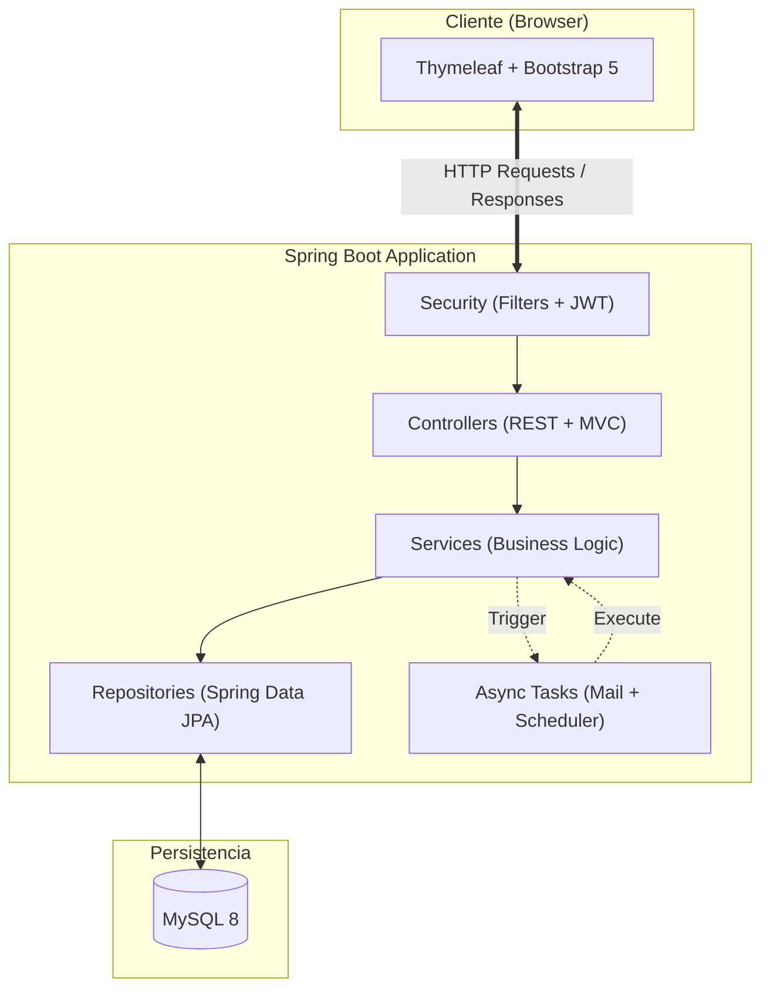
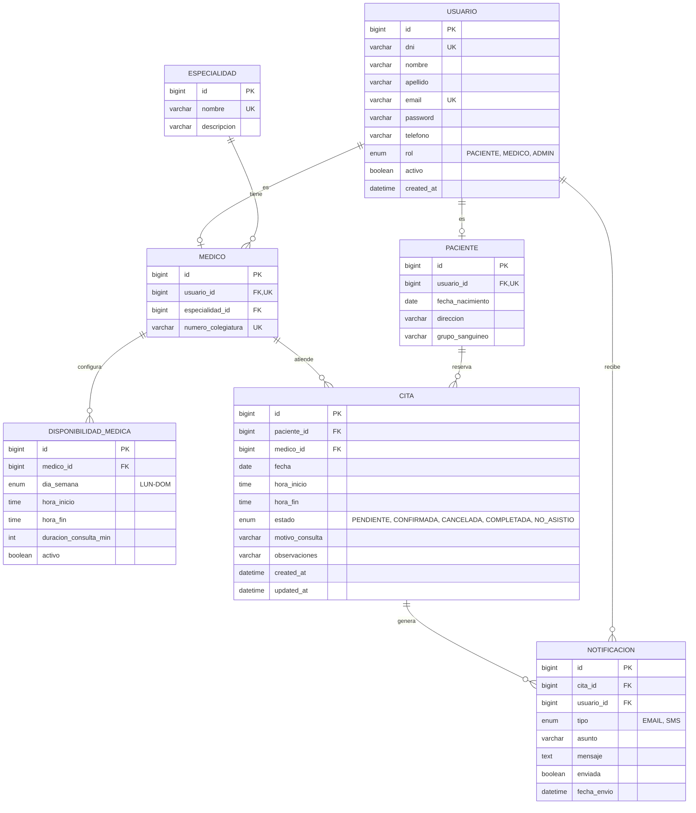
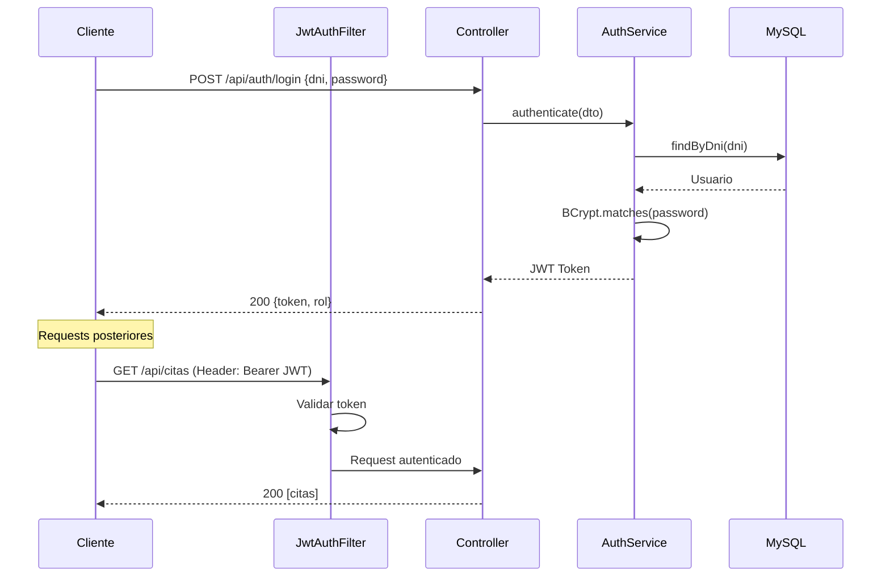
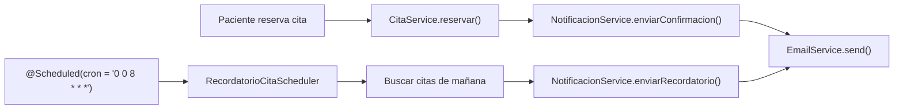

# 🏥 Plan de Implementación — SISOL Salud

> Sistema Inteligente de Turnos para Hospitales Públicos  
> **Stack:** Java 17 · Spring Boot 3.x · MySQL · Thymeleaf · JWT

---

## 📐 1. Arquitectura General


> Al ser Spring Boot fullstack, se usará **Thymeleaf** para las vistas y **REST Controllers** para endpoints API (Swagger). Ambos conviven en el mismo proyecto.

---

## 📦 2. Estructura de Paquetes

```
com.sisol.salud
├── config/                    # Configuraciones generales
│   ├── SecurityConfig.java
│   ├── SwaggerConfig.java
│   ├── MailConfig.java
│   └── SchedulerConfig.java
│
├── security/                  # Seguridad JWT
│   ├── jwt/
│   │   ├── JwtTokenProvider.java
│   │   ├── JwtAuthenticationFilter.java
│   │   └── JwtAuthEntryPoint.java
│   ├── CustomUserDetailsService.java
│   └── SecurityConstants.java
│
├── model/                     # Entidades JPA
│   ├── entity/
│   │   ├── Usuario.java
│   │   ├── Paciente.java
│   │   ├── Medico.java
│   │   ├── Especialidad.java
│   │   ├── DisponibilidadMedica.java
│   │   ├── Cita.java
│   │   └── Notificacion.java
│   ├── enums/
│   │   ├── Rol.java
│   │   ├── EstadoCita.java
│   │   └── TipoNotificacion.java
│
├── dto/                       # Data Transfer Objects
│   ├── request/
│   │   ├── LoginRequest.java
│   │   ├── RegistroRequest.java
│   │   ├── CitaRequest.java
│   │   └── DisponibilidadRequest.java
│   ├── response/
│   │   ├── AuthResponse.java
│   │   ├── CitaResponse.java
│   │   ├── MedicoResponse.java
│   │   ├── HorarioDisponibleResponse.java
│   │   └── ReporteResponse.java
│
├── mapper/                    # MapStruct Mappers
│   ├── CitaMapper.java
│   ├── MedicoMapper.java
│   └── PacienteMapper.java
│
├── repository/                # Spring Data JPA
│   ├── UsuarioRepository.java
│   ├── PacienteRepository.java
│   ├── MedicoRepository.java
│   ├── EspecialidadRepository.java
│   ├── DisponibilidadMedicaRepository.java
│   ├── CitaRepository.java
│   └── NotificacionRepository.java
│
├── service/                   # Lógica de negocio
│   ├── AuthService.java
│   ├── PacienteService.java
│   ├── MedicoService.java
│   ├── CitaService.java
│   ├── DisponibilidadService.java
│   ├── NotificacionService.java
│   ├── ReporteService.java
│   └── EmailService.java
│
├── controller/                # Controladores
│   ├── api/                   # REST API (JSON)
│   │   ├── AuthRestController.java
│   │   ├── CitaRestController.java
│   │   ├── MedicoRestController.java
│   │   └── ReporteRestController.java
│   ├── web/                   # MVC (Thymeleaf)
│   │   ├── HomeController.java
│   │   ├── AuthWebController.java
│   │   ├── PacienteWebController.java
│   │   ├── MedicoWebController.java
│   │   └── AdminWebController.java
│
├── exception/                 # Manejo de errores
│   ├── GlobalExceptionHandler.java
│   ├── ResourceNotFoundException.java
│   ├── CitaDuplicadaException.java
│   ├── HorarioNoDisponibleException.java
│   └── CredencialesInvalidasException.java
│
├── scheduler/                 # Tareas programadas
│   └── RecordatorioCitaScheduler.java
│
└── SisolSaludApplication.java
```

---

## 🗄️ 3. Modelo de Base de Datos



### Restricciones Clave

| Restricción | Implementación |
|---|---|
| Sin citas duplicadas | `UNIQUE(medico_id, fecha, hora_inicio)` |
| DNI único | `UNIQUE(dni)` en tabla `USUARIO` |
| Horario válido | Validación en `CitaService` contra `DISPONIBILIDAD_MEDICA` |
| Cancelación | Solo antes de 2 horas del turno |

---

## 🔐 4. Flujo de Seguridad (JWT)



---

## 🛣️ 5. Endpoints REST

### Auth (`/api/auth`)
| Método | Endpoint | Rol | Descripción |
|--------|----------|-----|-------------|
| POST | `/register` | PUBLIC | Registro de paciente |
| POST | `/login` | PUBLIC | Login → JWT |

### Médicos (`/api/medicos`)
| Método | Endpoint | Rol | Descripción |
|--------|----------|-----|-------------|
| GET | `/` | AUTH | Listar médicos |
| GET | `/{id}` | AUTH | Detalle médico |
| GET | `/especialidad/{id}` | AUTH | Médicos por especialidad |
| GET | `/{id}/disponibilidad` | AUTH | Horarios disponibles |
| POST | `/{id}/disponibilidad` | MEDICO | Crear disponibilidad |
| PUT | `/{id}/disponibilidad/{dispId}` | MEDICO | Editar disponibilidad |

### Citas (`/api/citas`)
| Método | Endpoint | Rol | Descripción |
|--------|----------|-----|-------------|
| POST | `/` | PACIENTE | Reservar cita |
| GET | `/mis-citas` | PACIENTE | Citas del paciente logueado |
| GET | `/medico` | MEDICO | Citas del médico logueado |
| PUT | `/{id}/cancelar` | PACIENTE, ADMIN | Cancelar cita |
| PUT | `/{id}/completar` | MEDICO | Marcar como completada |
| PUT | `/{id}/no-asistio` | MEDICO | Marcar inasistencia |
| GET | `/disponibilidad` | AUTH | Slots disponibles (query: medicoId, fecha) |

### Especialidades (`/api/especialidades`)
| Método | Endpoint | Rol | Descripción |
|--------|----------|-----|-------------|
| GET | `/` | PUBLIC | Listar especialidades |
| POST | `/` | ADMIN | Crear especialidad |

### Reportes (`/api/reportes`)
| Método | Endpoint | Rol | Descripción |
|--------|----------|-----|-------------|
| GET | `/citas-por-dia` | ADMIN | Total citas por día |
| GET | `/especialidades-top` | ADMIN | Especialidades más demandadas |
| GET | `/ausentismo` | ADMIN | Índice de ausentismo |
| GET | `/dashboard` | ADMIN | Estadísticas generales |

---

## 📧 6. Sistema de Notificaciones



| Evento | Canal | Momento |
|--------|-------|---------|
| Cita reservada | Email | Inmediato |
| Recordatorio | Email | 24h antes (8:00 AM) |
| Cita cancelada | Email | Inmediato |
| SMS (futuro) | SMS API | Diseño por interfaz `NotificacionSender` |

---

## ⚙️ 7. Dependencias Maven (`pom.xml`)

```xml
<!-- Core -->
spring-boot-starter-web
spring-boot-starter-data-jpa
spring-boot-starter-thymeleaf
spring-boot-starter-validation
spring-boot-devtools
mysql-connector-j

<!-- Seguridad -->
spring-boot-starter-security
jjwt-api (0.12.x) + jjwt-impl + jjwt-jackson

<!-- Notificaciones -->
spring-boot-starter-mail

<!-- Documentación -->
springdoc-openapi-starter-webmvc-ui (2.x)

<!-- Utilidades -->
lombok
mapstruct + mapstruct-processor
spring-boot-starter-actuator
jackson-datatype-jsr310

<!-- Frontend -->
bootstrap (5.3.x vía WebJars)
bootstrap-icons (vía WebJars)

<!-- Testing -->
spring-boot-starter-test
spring-security-test
h2database (para tests)
```

---

## 🗓️ 8. Fases de Implementación

### Fase 0 — Setup del Proyecto

| # | Tarea |
|---|-------|
| 0.1 | Crear proyecto con Spring Initializr (Java 17, Maven, Boot 3.2+) |
| 0.2 | Configurar `pom.xml` con todas las dependencias |
| 0.3 | Configurar `application.properties` / `application.yml` |
| 0.4 | Crear base de datos MySQL `sisol_salud_db` |
| 0.5 | Configurar estructura de paquetes base |
| 0.6 | Configurar Git: `.gitignore`, primer commit |

---

### Fase 1 — Modelo de Datos y Entidades 

| # | Tarea |
|---|-------|
| 1.1 | Crear enums: `Rol`, `EstadoCita`, `DiaSemana`, `TipoNotificacion` |
| 1.2 | Crear entidad `Usuario` con campos y validaciones |
| 1.3 | Crear entidad `Paciente` (relación `@OneToOne` con `Usuario`) |
| 1.4 | Crear entidad `Especialidad` |
| 1.5 | Crear entidad `Medico` (relación con `Usuario` y `Especialidad`) |
| 1.6 | Crear entidad `DisponibilidadMedica` (relación con `Medico`) |
| 1.7 | Crear entidad `Cita` (relación con `Paciente` y `Medico`) |
| 1.8 | Crear entidad `Notificacion` (relación con `Cita` y `Usuario`) |
| 1.9 | Crear todos los Repositories (interfaces JPA) |
| 1.10 | Crear script `data.sql` con datos iniciales (especialidades, admin) |
| 1.11 | Verificar generación automática de tablas con `ddl-auto=update` |

---

### Fase 2 — Seguridad y Autenticación 

| # | Tarea |
|---|-------|
| 2.1 | Crear `SecurityConstants` (clave secreta, expiración, prefijo) |
| 2.2 | Implementar `JwtTokenProvider` (generar, validar, extraer claims) |
| 2.3 | Implementar `CustomUserDetailsService` |
| 2.4 | Implementar `JwtAuthenticationFilter` (OncePerRequestFilter) |
| 2.5 | Implementar `JwtAuthEntryPoint` |
| 2.6 | Configurar `SecurityConfig` (cadena de filtros, CORS, rutas públicas) |
| 2.7 | Crear DTOs: `LoginRequest`, `RegistroRequest`, `AuthResponse` |
| 2.8 | Implementar `AuthService` (registro con BCrypt, login con JWT) |
| 2.9 | Crear `AuthRestController` (`/api/auth/**`) |
| 2.10 | Crear excepciones: `CredencialesInvalidasException` |
| 2.11 | Probar con Postman / Swagger: registro y login |

---

### Fase 3 — Gestión de Médicos y Disponibilidad

| # | Tarea |
|---|-------|
| 3.1 | Crear DTOs: `MedicoResponse`, `DisponibilidadRequest/Response` |
| 3.2 | Crear `MedicoMapper` (MapStruct) |
| 3.3 | Implementar `MedicoService` (listar, buscar por especialidad) |
| 3.4 | Implementar `DisponibilidadService` (CRUD horarios del médico) |
| 3.5 | Crear `MedicoRestController` |
| 3.6 | Queries personalizadas en `MedicoRepository` |
| 3.7 | Validaciones: horarios no solapados, duración mínima |

---

### Fase 4 — Gestión de Citas 

> [!IMPORTANT]
> Esta es la fase más crítica del sistema. La lógica de disponibilidad y anti-duplicación debe ser robusta.

| # | Tarea |
|---|-------|
| 4.1 | Crear DTOs: `CitaRequest`, `CitaResponse`, `HorarioDisponibleResponse` |
| 4.2 | Crear `CitaMapper` |
| 4.3 | Implementar algoritmo de slots disponibles en `DisponibilidadService` |
| 4.4 | Implementar `CitaService.reservar()` con validaciones: |
|     | — Verificar que el slot existe y está libre |
|     | — Verificar que el paciente no tiene otra cita a esa hora |
|     | — Verificar que el médico no tiene otra cita a esa hora |
|     | — Crear cita con estado `PENDIENTE` |
| 4.5 | Implementar cancelación (solo si faltan > 2h) |
| 4.6 | Implementar completar / marcar no asistió |
| 4.7 | Crear `CitaRestController` |
| 4.8 | Crear excepciones: `CitaDuplicadaException`, `HorarioNoDisponibleException` |
| 4.9 | Implementar `GlobalExceptionHandler` con `@ControllerAdvice` |

---

### Fase 5 — Notificaciones 

| # | Tarea |
|---|-------|
| 5.1 | Configurar Spring Mail (SMTP Gmail/Mailtrap) |
| 5.2 | Implementar `EmailService` (envío con plantilla HTML) |
| 5.3 | Crear plantillas de email (Thymeleaf para emails) |
| 5.4 | Implementar `NotificacionService` (confirmación, cancelación) |
| 5.5 | Integrar envío de email en flujo de `CitaService` |
| 5.6 | Implementar `RecordatorioCitaScheduler` (@Scheduled, cron diario) |
| 5.7 | Crear interfaz `NotificacionSender` para extensibilidad (SMS futuro) |
| 5.8 | Guardar registro de notificaciones en BD |

---

### Fase 6 — Panel de Administración y Reportes 

| # | Tarea |
|---|-------|
| 6.1 | Crear DTOs de reportes: `ReporteResponse`, `EstadisticaResponse` |
| 6.2 | Implementar `ReporteService` con queries JPQL/nativas |
| 6.3 | Queries: citas por día, top especialidades, tasa ausentismo |
| 6.4 | Crear `ReporteRestController` (solo ADMIN) |
| 6.5 | Dashboard con métricas agregadas |

---

### Fase 7 — Frontend con Thymeleaf 

| # | Tarea |
|---|-------|
| 7.1 | Layout base (`layout.html`) con Bootstrap 5 + navbar |
| 7.2 | Páginas públicas: Login, Registro |
| 7.3 | Dashboard Paciente: mis citas, reservar cita |
| 7.4 | Flujo de reserva: seleccionar especialidad → médico → fecha → hora |
| 7.5 | Dashboard Médico: mis citas del día, gestión de disponibilidad |
| 7.6 | Dashboard Admin: reportes con gráficos (Chart.js) |
| 7.7 | Diseño responsive (Bootstrap grid + media queries) |
| 7.8 | Manejo de sesión con JWT en cookies HttpOnly |
| 7.9 | Mensajes de éxito/error con alertas Bootstrap |

---

### Fase 8 — Testing y Documentación 

| # | Tarea |
|---|-------|
| 8.1 | Tests unitarios: Services (Mockito) |
| 8.2 | Tests de integración: Controllers (MockMvc) |
| 8.3 | Tests de repositorio con H2 embebido |
| 8.4 | Configurar Swagger/OpenAPI con anotaciones |
| 8.5 | Documentar endpoints con `@Operation`, `@ApiResponse` |
| 8.6 | Swagger UI accesible en `/swagger-ui.html` |

---

### Fase 9 — Pulido Final 

| # | Tarea |
|---|-------|
| 9.1 | Spring Actuator: health, metrics |
| 9.2 | Logging con SLF4J en servicios clave |
| 9.3 | Revisar validaciones `@Valid` en todos los endpoints |
| 9.4 | Revisar seguridad: rutas protegidas, CORS, CSRF |
| 9.5 | Seed data completo para demo |
| 9.6 | README.md con instrucciones de instalación |

---

## 📊 9. Resumen de Esfuerzo Estimado

| Fase | Descripción |
|------|-------------|
| 0 | Setup del proyecto |
| 1 | Modelo de datos y entidades |
| 2 | Seguridad y autenticación |
| 3 | Gestión de médicos |
| 4 | Gestión de citas |
| 5 | Notificaciones |
| 6 | Reportes y admin |
| 7 | Frontend Thymeleaf |
| 8 | Testing y documentación |
| 9 | Pulido final |

---

## 🧭 10. Patrones y Buenas Prácticas Aplicadas

| Patrón | Dónde se aplica |
|--------|-----------------|
| **DTO Pattern** | Separar entidades de la API pública |
| **Repository Pattern** | Spring Data JPA interfaces |
| **Service Layer** | Toda la lógica de negocio en servicios |
| **Strategy Pattern** | `NotificacionSender` (Email, SMS) |
| **Builder Pattern** | Lombok `@Builder` en DTOs |
| **Global Exception Handling** | `@ControllerAdvice` + excepciones custom |
| **Mapper Pattern** | MapStruct para Entity ↔ DTO |
| **Template Method** | Plantillas de email con Thymeleaf |
| **Scheduler** | `@Scheduled` para recordatorios automáticos |
| **Filter Chain** | JWT filter en Spring Security |

---

## 📂 11. Estructura de Archivos Thymeleaf

```
src/main/resources/
├── templates/
│   ├── layout/
│   │   └── base.html           # Layout con navbar y footer
│   ├── auth/
│   │   ├── login.html
│   │   └── registro.html
│   ├── paciente/
│   │   ├── dashboard.html
│   │   ├── mis-citas.html
│   │   └── reservar-cita.html
│   ├── medico/
│   │   ├── dashboard.html
│   │   ├── mis-citas.html
│   │   └── disponibilidad.html
│   ├── admin/
│   │   ├── dashboard.html
│   │   ├── reportes.html
│   │   └── gestion-medicos.html
│   ├── email/
│   │   ├── confirmacion-cita.html
│   │   └── recordatorio-cita.html
│   └── fragments/
│       ├── navbar.html
│       ├── footer.html
│       └── alerts.html
├── static/
│   ├── css/
│   │   └── styles.css
│   ├── js/
│   │   └── app.js
│   └── img/
└── application.yml
```

---