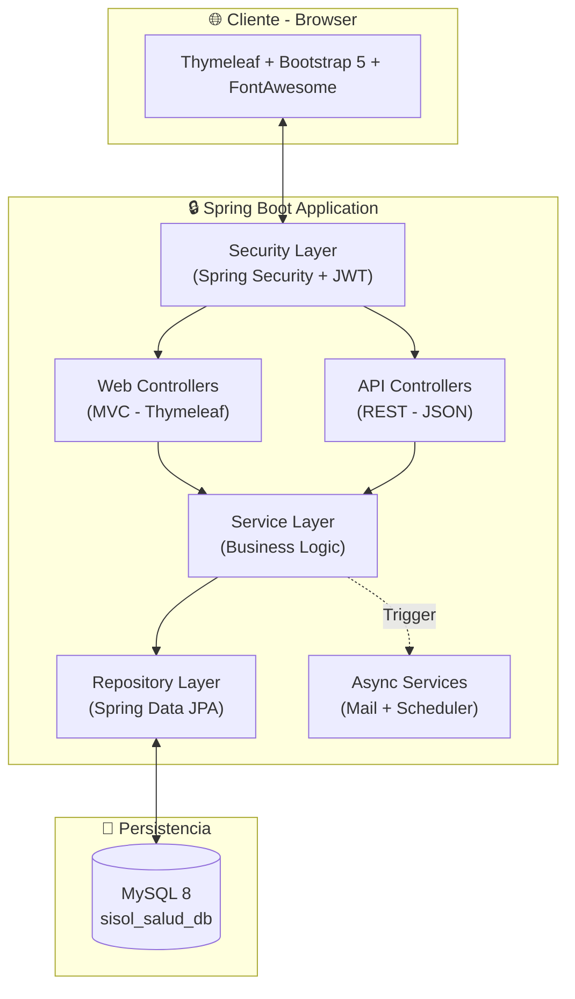
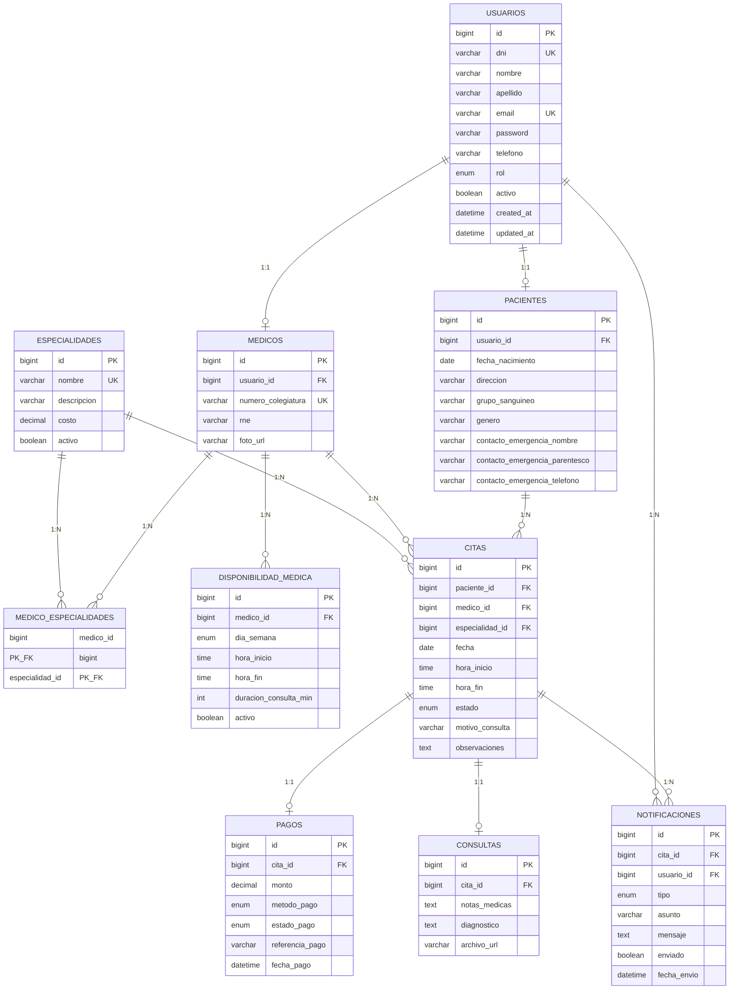
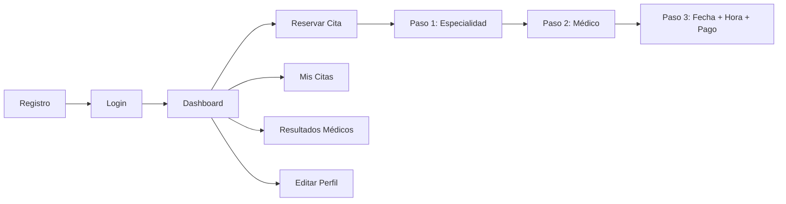
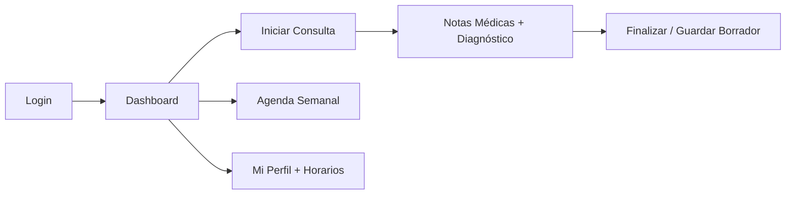
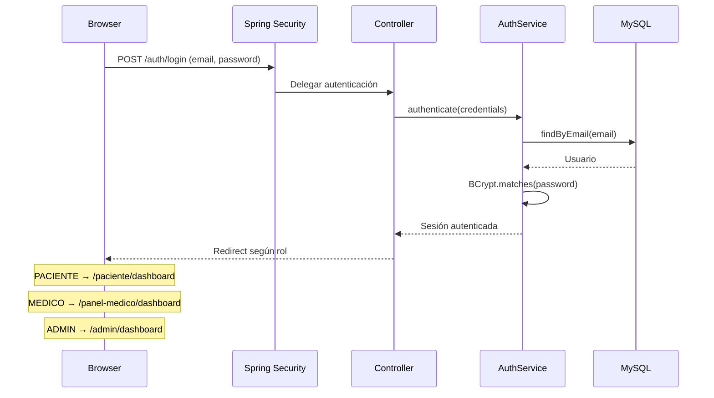
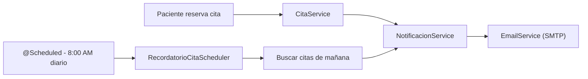

# 🏥 SISOL Salud

> Sistema Inteligente de Gestión de Citas Médicas para Hospitales Públicos.
> Plataforma fullstack construida con Spring Boot 3.5 + Thymeleaf que permite a pacientes reservar citas, a médicos gestionar su agenda y consultas, y a administradores supervisar el sistema.


---

## 📖 Índice

- [Arquitectura](#-arquitectura)
- [Modelo de Base de Datos](#-modelo-de-base-de-datos)
- [Estructura del Proyecto](#-estructura-del-proyecto)
- [Roles y Flujos de Usuario](#-roles-y-flujos-de-usuario)
- [Stack Tecnológico](#-stack-tecnológico)
- [Requisitos Previos](#-requisitos-previos)
- [Instalación y Ejecución](#-instalación-y-ejecución)
- [Endpoints REST API](#-endpoints-rest-api)
- [Vistas Thymeleaf](#-vistas-thymeleaf)
- [Seguridad](#-seguridad)
- [Sistema de Notificaciones](#-sistema-de-notificaciones)

---

## 🏗️ Arquitectura

La aplicación sigue una **arquitectura en capas** (Layered Architecture) con separación clara de responsabilidades:



> **Nota:** El proyecto es fullstack monolítico. Las vistas se renderizan con **Thymeleaf** (Server-Side Rendering) y coexisten con controladores REST para la API documentada con Swagger.

---

## 🗄️ Modelo de Base de Datos

### Diagrama Entidad-Relación



### Tabla intermedia (ManyToMany)

| Tabla | Columnas | Descripción |
|-------|----------|-------------|
| `medico_especialidades` | `medico_id`, `especialidad_id` | Un médico puede tener N especialidades |

---

## 📁 Estructura del Proyecto

```
com.sisol.salud/
├── config/                          # Configuraciones
│   ├── DataSeeder.java              # Datos de prueba al iniciar
│   ├── SecurityConfig.java          # Configuración Spring Security
│   ├── SwaggerConfig.java           # Configuración OpenAPI
│   └── MailConfig.java              # Configuración SMTP
│
├── security/                        # Capa de seguridad
│   ├── jwt/
│   │   ├── JwtTokenProvider.java    # Generación/validación JWT
│   │   ├── JwtAuthenticationFilter.java
│   │   └── JwtAuthEntryPoint.java
│   └── CustomUserDetailsService.java
│
├── model/                           # Capa de dominio
│   ├── entity/
│   │   ├── Usuario.java             # Tabla madre de autenticación
│   │   ├── Paciente.java            # Datos clínicos del paciente
│   │   ├── Medico.java              # Datos profesionales del médico
│   │   ├── Especialidad.java        # Catálogo de especialidades
│   │   ├── DisponibilidadMedica.java # Horarios del médico
│   │   ├── Cita.java                # Reservas de citas
│   │   ├── Consulta.java            # Registro de la consulta médica
│   │   ├── Pago.java                # Pagos de citas
│   │   └── Notificacion.java        # Notificaciones al usuario
│   └── enums/
│       ├── Rol.java                 # PACIENTE, MEDICO, ADMIN
│       ├── EstadoCita.java          # PENDIENTE, CONFIRMADA, CANCELADA, COMPLETADA, NO_ASISTIO
│       ├── EstadoPago.java          # PENDIENTE, PAGADO, REEMBOLSADO
│       ├── MetodoPago.java          # EFECTIVO, TARJETA_DEBITO, YAPE, PLIN, etc.
│       ├── DiaSemana.java           # LUNES a DOMINGO
│       └── TipoNotificacion.java    # EMAIL, SMS
│
├── repository/                      # Capa de acceso a datos (JPA)
│   ├── UsuarioRepository.java
│   ├── PacienteRepository.java
│   ├── MedicoRepository.java
│   ├── EspecialidadRepository.java
│   ├── DisponibilidadMedicaRepository.java
│   ├── CitaRepository.java
│   ├── ConsultaRepository.java
│   ├── PagoRepository.java
│   └── NotificacionRepository.java
│
├── service/                         # Capa de lógica de negocio
│   ├── AuthService.java             # Registro + login
│   ├── CitaService.java             # Reserva, cancelación, estados
│   ├── DisponibilidadService.java   # CRUD horarios médicos
│   ├── MedicoService.java           # Consultas de médicos
│   ├── PagoService.java             # Procesamiento de pagos
│   ├── NotificacionService.java     # Envío de notificaciones
│   ├── EmailService.java            # Servicio SMTP
│   ├── ReporteService.java          # Estadísticas y reportes
│   └── NotificacionSender.java      # Interfaz Strategy (Email/SMS)
│
├── controller/
│   ├── web/                         # Controladores MVC (Thymeleaf)
│   │   ├── HomeController.java      # Páginas públicas (index, servicios, etc.)
│   │   ├── AuthWebController.java   # Login, registro, redirección por rol
│   │   ├── PacienteWebController.java # Dashboard, perfil, reservas paciente
│   │   ├── MedicoPanelWebController.java # Panel interno del médico
│   │   ├── MedicoWebController.java # Vista pública de médicos
│   │   └── AdminWebController.java  # Panel de administración
│   └── api/                         # Controladores REST (JSON)
│       ├── AuthRestController.java
│       ├── CitaRestController.java
│       ├── MedicoRestController.java
│       └── ReporteRestController.java
│
├── dto/                             # Data Transfer Objects
├── mapper/                          # MapStruct mappers
├── exception/                       # Excepciones personalizadas
├── scheduler/                       # Tareas programadas (@Scheduled)
└── SisolSaludApplication.java       # Punto de entrada
```

### Estructura de Vistas (Thymeleaf)

```
src/main/resources/templates/
├── layout/
│   ├── base.html                    # Layout público (navbar + footer)
│   └── medico_base.html             # Layout médico (sidebar granate)
│
├── index.html                       # Página principal pública
├── servicios.html                   # Servicios de SISOL Salud
├── medicos.html                     # Directorio público de médicos
├── nosotros.html                    # Acerca de nosotros
│
├── auth/
│   ├── login.html                   # Inicio de sesión
│   └── registro.html                # Registro de pacientes
│
├── paciente/
│   ├── dashboard.html               # Panel principal del paciente
│   ├── mis-citas.html               # Historial de citas (próximas + pasadas)
│   ├── perfil.html                  # Editar perfil + Seguridad + Notificaciones
│   ├── resultados.html              # Resultados médicos (PDFs)
│   ├── reservar-paso1.html          # Paso 1: Seleccionar especialidad
│   ├── reservar-paso2.html          # Paso 2: Seleccionar médico
│   └── reservar-paso3.html          # Paso 3: Fecha, hora y pago
│
├── medico/
│   ├── dashboard.html               # Panel principal del médico
│   ├── citas-hoy.html               # Agenda semanal (Schedule)
│   ├── consulta.html                # Vista "En Consulta" (notas + diagnóstico)
│   └── disponibilidad.html          # Perfil + horario de trabajo
│
├── fragments/                       # Fragmentos reutilizables
└── email/                           # Plantillas de correo
```

---

## 👥 Roles y Flujos de Usuario

### 🔵 Paciente (`PACIENTE`)



### 🔴 Médico (`MEDICO`)



### ⚙️ Admin (`ADMIN`)
> Panel de administración planificado para implementación futura.

---

## 🛠️ Stack Tecnológico

| Capa | Tecnología | Versión |
|------|-----------|---------|
| **Lenguaje** | Java | 17 |
| **Framework** | Spring Boot | 3.5.9 |
| **ORM** | Hibernate / Spring Data JPA | 6.x |
| **Auditoría** | Hibernate Envers | 6.x |
| **Seguridad** | Spring Security + JWT (jjwt) | 0.12.6 |
| **Motor de vistas** | Thymeleaf + Layout Dialect | 3.x |
| **Base de datos** | MySQL | 8.0 |
| **CSS Framework** | Bootstrap | 5.3 |
| **Iconos** | FontAwesome + Bootstrap Icons | 6.4 / 1.11 |
| **Fuentes** | Google Fonts (Manrope, Inter, Outfit) | — |
| **Documentación API** | SpringDoc OpenAPI (Swagger UI) | 2.x |
| **Email** | Spring Mail (SMTP) | — |
| **Mapeo DTO** | MapStruct | 1.5.5 |
| **Utilidades** | Lombok | — |
| **Build Tool** | Maven (con Maven Wrapper) | 3.x |
| **Testing** | JUnit 5 + Mockito + H2 | — |

---

## 📋 Requisitos Previos

- **Java 17** o superior ([Descargar](https://adoptium.net/))
- **MySQL 8.0** ([Descargar](https://dev.mysql.com/downloads/))
- **Git** ([Descargar](https://git-scm.com/))
- Un IDE como IntelliJ IDEA, Eclipse o VS Code

> **Nota:** No necesitas instalar Maven. El proyecto incluye Maven Wrapper (`mvnw`).

---

## 🚀 Instalación y Ejecución

### 1. Clonar el repositorio

```bash
git clone https://github.com/Alessandro-BS/Proyecto-Integrador.git
cd Proyecto-Integrador
```

### 2. Crear la base de datos

```sql
CREATE DATABASE sisol_salud_db;
```

### 3. Configurar credenciales

Editar `src/main/resources/application.properties`:

```properties
spring.datasource.url=jdbc:mysql://localhost:3306/sisol_salud_db
spring.datasource.username=TU_USUARIO
spring.datasource.password=TU_PASSWORD
```

### 4. Ejecutar la aplicación

```bash
# Windows
.\mvnw.cmd spring-boot:run

# Linux / Mac
./mvnw spring-boot:run
```

### 5. Acceder

| Recurso | URL |
|---------|-----|
| Portal público | `http://localhost:8080` |
| Login | `http://localhost:8080/auth/login` |
| Swagger UI | `http://localhost:8080/swagger-ui.html` |

### Credenciales de prueba

| Rol | Email | Contraseña |
|-----|-------|------------|
| Médico | `doctor@sisol.com` | `123456` |

> Se crean automáticamente al iniciar la aplicación gracias a `DataSeeder.java`.

---

## 🌐 Endpoints REST API

### Auth (`/api/auth`)
| Método | Endpoint | Acceso | Descripción |
|--------|----------|--------|-------------|
| `POST` | `/register` | Público | Registrar paciente |
| `POST` | `/login` | Público | Autenticarse → JWT |

### Citas (`/api/citas`)
| Método | Endpoint | Acceso | Descripción |
|--------|----------|--------|-------------|
| `POST` | `/` | PACIENTE | Reservar una cita |
| `GET` | `/mis-citas` | PACIENTE | Listar citas del paciente |
| `GET` | `/medico` | MEDICO | Listar citas del médico |
| `PUT` | `/{id}/cancelar` | PACIENTE | Cancelar cita (>2h antes) |
| `PUT` | `/{id}/completar` | MEDICO | Marcar cita completada |
| `PUT` | `/{id}/no-asistio` | MEDICO | Marcar inasistencia |
| `GET` | `/disponibilidad` | AUTH | Consultar slots disponibles |

### Médicos (`/api/medicos`)
| Método | Endpoint | Acceso | Descripción |
|--------|----------|--------|-------------|
| `GET` | `/` | AUTH | Listar todos los médicos |
| `GET` | `/{id}` | AUTH | Detalle de un médico |
| `GET` | `/especialidad/{id}` | AUTH | Médicos por especialidad |
| `GET` | `/{id}/disponibilidad` | AUTH | Horarios de un médico |

### Reportes (`/api/reportes`)
| Método | Endpoint | Acceso | Descripción |
|--------|----------|--------|-------------|
| `GET` | `/dashboard` | ADMIN | Estadísticas generales |

> 📘 Documentación interactiva completa en **Swagger UI**: `http://localhost:8080/swagger-ui.html`

---

## 🔐 Seguridad



### Características de seguridad
- Passwords hasheados con **BCrypt**
- Protección CSRF habilitada para formularios
- Sesiones gestionadas por Spring Security
- JWT disponible para endpoints REST API
- Redirección automática por rol al hacer login
- Modal de confirmación al cerrar sesión (panel médico)

---

## 📧 Sistema de Notificaciones



| Evento | Canal | Momento |
|--------|-------|---------|
| Cita reservada | Email | Inmediato |
| Cita cancelada | Email | Inmediato |
| Recordatorio de cita | Email | 24h antes (8:00 AM) |

> Diseño extensible mediante interfaz `NotificacionSender` (patrón Strategy) para agregar SMS en el futuro.

---

## 🧪 Testing

```bash
# Ejecutar todos los tests
.\mvnw.cmd test

# Ejecutar un test específico
.\mvnw.cmd test -Dtest=MedicoServiceTest
```

| Tipo | Framework | Base de datos |
|------|-----------|---------------|
| Unitarios | JUnit 5 + Mockito | — |
| Integración | Spring Boot Test + MockMvc | H2 (en memoria) |

---

## 📄 Licencia

Este proyecto es de uso académico — Proyecto Integrador.

---

<p align="center">
  <b>SISOL Salud</b> — Brindando atención médica de calidad accesible para todos los peruanos con la calidez que nos caracteriza.
</p>