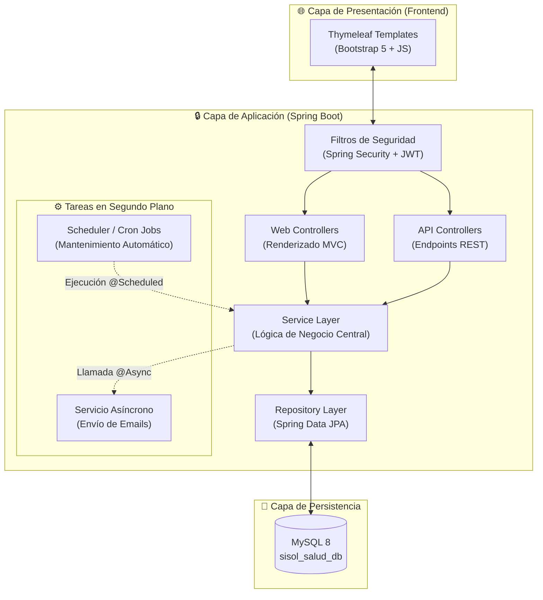
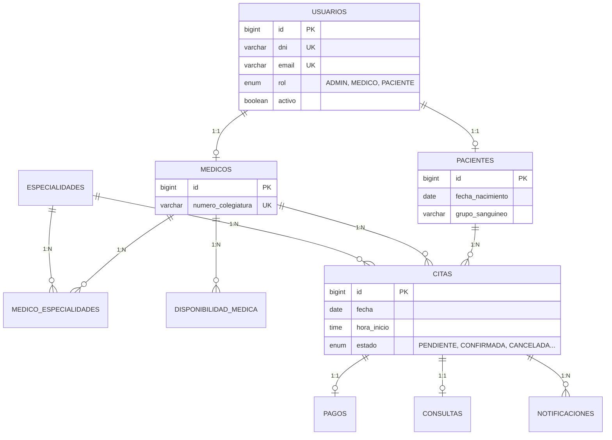
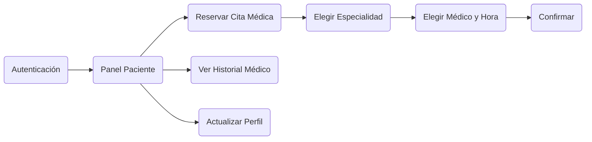
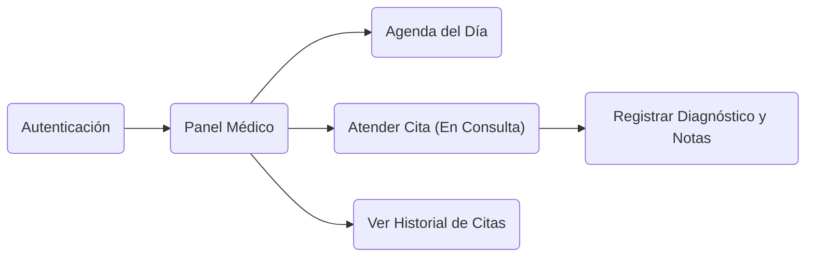
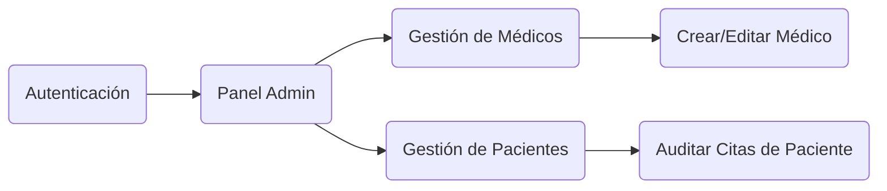

# 🏥 SISOL Salud

> Sistema Inteligente de Gestión de Citas Médicas para Centros de Salud.
> Plataforma web fullstack construida con Spring Boot 3.5 y Arquitectura MVC que permite a los pacientes reservar citas, a los médicos gestionar sus consultas, y a los administradores supervisar la operatividad del sistema de manera centralizada.


---

## 📖 Índice

- [Arquitectura del Sistema](#-arquitectura-del-sistema)
- [Modelo de Base de Datos (ERD)](#-modelo-de-base-de-datos-erd)
- [Estructura del Proyecto (Clean Code)](#-estructura-del-proyecto-clean-code)
- [Roles y Flujos de Usuario](#-roles-y-flujos-de-usuario)
- [Mantenimiento y DevOps](#-mantenimiento-y-devops)
- [Stack Tecnológico](#-stack-tecnológico)
- [Endpoints REST y Controladores Web](#-endpoints-rest-y-controladores-web)
- [Instalación y Ejecución](#-instalación-y-ejecución)

---

## 🏗️ Arquitectura del Sistema

La aplicación sigue una **arquitectura de n-capas** (Layered Architecture) con separación estricta de responsabilidades, integrando procesamiento síncrono para peticiones HTTP y procesamiento asíncrono para tareas de fondo.



> **Nota Arquitectónica:** El proyecto es un monolito estructurado. Las vistas se renderizan desde el servidor (Server-Side Rendering) y coexisten con controladores REST para futuras integraciones móviles.

---

## 🗄️ Modelo de Base de Datos (ERD)

El diseño relacional asegura la integridad referencial y está auditado mediante *Hibernate Envers* (generación automática de tablas `_aud`).



---

## 📁 Estructura del Proyecto (Clean Code)

La distribución de directorios respeta los principios de Clean Architecture y mantenibilidad de código.

```text
src/main/java/com/sisol/salud/
├── config/             # Configuraciones globales (Seguridad, Swagger, Mail, DataSeeder)
├── controller/         # Puntos de entrada HTTP
│   ├── api/            # Controladores que retornan JSON (@RestController)
│   └── web/            # Controladores que retornan vistas HTML (@Controller)
├── dto/                # Objetos de Transferencia de Datos
├── exception/          # Manejadores globales de errores (@ControllerAdvice)
├── mapper/             # Mapeos automáticos Entity <-> DTO (MapStruct)
├── model/              # Dominio del negocio
│   ├── entity/         # Entidades persistentes (JPA)
│   └── enums/          # Enumeradores de estado (Roles, Estados de cita)
├── repository/         # Interfaces de acceso a base de datos (Spring Data)
├── scheduler/          # Procesos automatizados y Cron Jobs
└── service/            # Lógica de negocio core (Transaccional)

src/main/resources/
├── templates/          # Vistas HTML Thymeleaf
│   ├── admin/          # Interfaz de gestión
│   ├── auth/           # Login y registro
│   ├── email/          # Plantillas de notificaciones (HTML/CSS inline)
│   ├── medico/         # Panel del médico
│   ├── paciente/       # Panel del paciente
│   └── layout/         # Componentes base (Header, Sidebar, Footer)
└── application.yml     # Configuración de propiedades del entorno
```

---

## 👥 Roles y Flujos de Usuario

El sistema cuenta con un control de acceso basado en roles (RBAC).

### 🔵 Paciente (`ROLE_PACIENTE`)


### 🔴 Médico (`ROLE_MEDICO`)


### ⚙️ Administrador (`ROLE_ADMIN`)


---

## 🛠️ Mantenimiento y DevOps

El sistema incluye operabilidad a nivel de infraestructura para asegurar la continuidad del negocio.

### 1. Tareas Programadas (Cron Jobs)
El proyecto utiliza `@EnableScheduling` nativo de Spring Boot. 
En el paquete `scheduler`, la clase `MantenimientoCronService.java` ejecuta limpieza de datos y cancelaciones automáticas (Ej: Citas vencidas no pagadas).

### 2. Copias de Seguridad (Backups Automáticos)
Se incluye un script ejecutable en la raíz del proyecto (`backup_sisol.bat`) que automatiza el volcado de la base de datos `sisol_salud` usando `mysqldump`.
**Uso sugerido en Producción:** Asociar este archivo al _Programador de Tareas de Windows_ o _Cron_ en Linux para generar backups a las 02:00 AM diarios en el directorio `C:\Backups\`.

---

## 💻 Stack Tecnológico

| Componente | Tecnología | Versión |
|------------|-----------|---------|
| **Core Backend** | Java / Spring Boot | 17 / 3.5.9 |
| **Persistencia** | MySQL / Spring Data JPA | 8.0 / Hibernate 6.x |
| **Seguridad** | Spring Security + JWT | 6.x |
| **Frontend** | Thymeleaf + Bootstrap | 3.x / 5.3 |
| **Documentación**| SpringDoc OpenAPI | 2.x |
| **Mapeo / Utils**| MapStruct / Lombok | 1.5.5 / - |

---

## 🚀 Instalación y Ejecución

### Requisitos
- **Java 17 JDK** instalado.
- **MySQL 8** ejecutándose en el puerto 3306.
- (Opcional) **Git** para clonar el repositorio.

### Paso 1: Base de Datos
Crea la base de datos en tu entorno local de MySQL:
```sql
CREATE DATABASE sisol_salud_db;
```

### Paso 2: Configuración (application.yml)
Navega a `src/main/resources/application.yml` y verifica tus credenciales locales:
```yaml
spring:
  datasource:
    url: jdbc:mysql://localhost:3306/sisol_salud_db
    username: root
    password: tu_password_local
```

### Paso 3: Ejecución del Proyecto
Abre tu terminal en la carpeta raíz del proyecto y ejecuta el Wrapper de Maven (No necesitas descargar Maven manualmente):

**En Windows:**
```cmd
.\mvnw.cmd spring-boot:run
```

**En Linux / Mac:**
```bash
./mvnw spring-boot:run
```

El DataSeeder automático inyectará las especialidades, y los usuarios de prueba en la base de datos al arrancar por primera vez.

### Paso 4: Accesos de Prueba
Ingresa a `http://localhost:8080` y utiliza las credenciales que se imprimen en la consola al iniciar el sistema.
Por defecto:
- **Admin:** `admin@sisol.com` / `123456`
- **Médico:** `carlos.mendoza@sisol.com` / `123456`
- **Paciente:** `juan.perez@gmail.com` / `123456`

---
*Desarrollado con altos estándares de calidad e ingeniería de software para el Proyecto Integrador.*